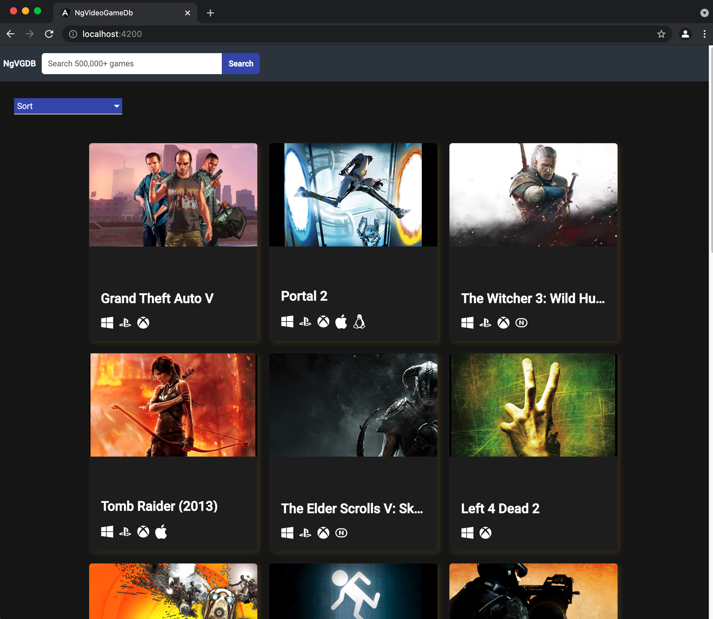

## Home/Search

## Search

## Search Detail

- https://www.youtube.com/watch?v=LiOzTQAz13Q
  - uses video game DB API that requires token set in header
    - https://rapidapi.com/accujazz/api/rawg-video-games-database/details
    - https://rawg.io/apidocs

- http interceptors 
  - modify http request params/headers at the application level 

- activated route 
  - subscribe to params of a route and get access to its route API & possibly state
  - need to unsubscribe from activated route  and call ngOnDestroy to avoid memory leaks? 

- subscribing to http services
  - an observable is returned
    - forkJoin is basically Promise.all 

- material ui styling